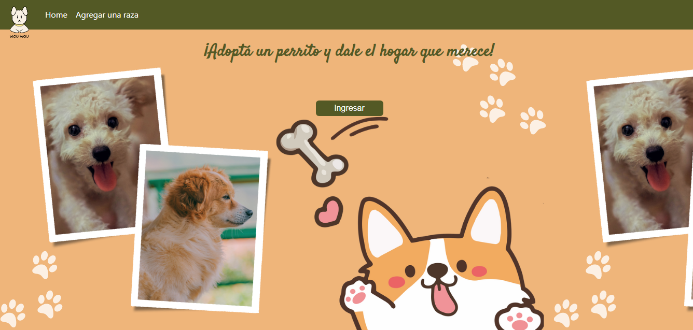
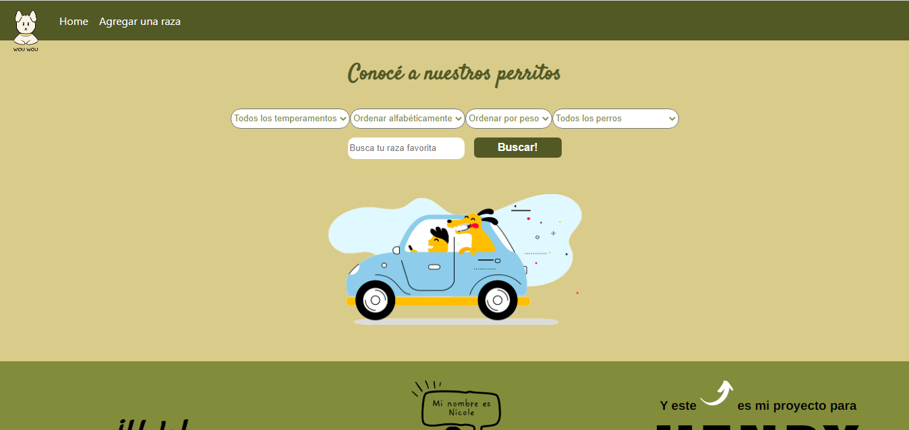
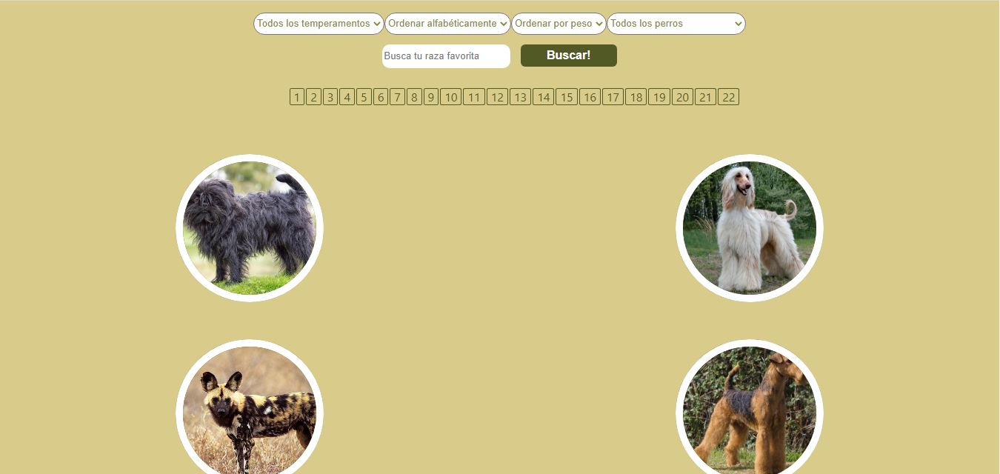
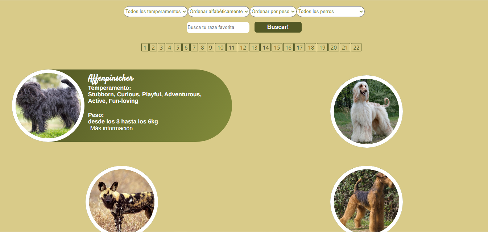
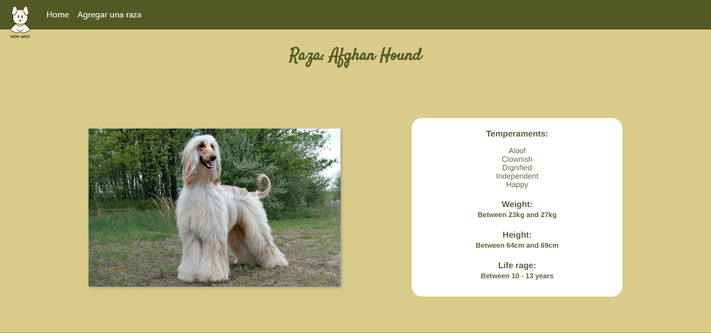

# PI-Dogs-Henry

This is a student project done as a final assigment, in wich join all the technologies learned at SoyHenry bootcamp, in addition the academy gathered the best developers of the *26A cohort* to make the first delivery of this app for a future deployment.

## About

This project allows users to view, search, save and create diferent dog´s breeds.
---

- <a href="https://pi-dogs-henry-ten.vercel.app/">Deployment link<a>

## Project Objetives

- Build a React Js app from scratch
- Afirm and conect all the learned concepts in the Carreer 
- Practice GIT workflow
- learn good programming practices

## Stack of Technologies

### Front End:
HTML, CSS, Javascript, React, Redux, Bootstrap.

### Back End:
Node.js, Express, Sequelize.

### Database:
PostgreSQL.

## BoilerPlate

The boilerPlate has two folders: `api` and `client`.

Inside `api` you must have to create a file called: `.env` 
that has the following form: 

```
DB_USER=postgresuser
DB_PASSWORD=postgrespassword
DB_HOST=localhost
PORT=postgresport
```
You have to replace `postgresuser`, `postgrespassword` and `postgresport` with your own credentials to connect to postgres database. This file will be ignored by github, as it contains sensitive information (the credentials).

## Next 
### _Connect the data base_

 - Go to your postgres database manager and create a new   database. Replace `"data_base_name"` in `.env` file with the name of the new database.

 ### _Install the necesary package to run it_

- Open the project console
    + Inside `api` folder, run the command line, `npm install` / `yarn install` 
    + Inside `client` folder, run the command line, `npm install` / `yarn install`.

### _Run the project_

- Open the project console
    + Inside `api` folder, run the command line, `npm run dev` / `yarn run dev`.

    + Inside `api` folder, run the command line, `npm run seed` / `yarn run seed` to fill the database, while the back is running.

    + Inside `client` folder, run the command line, `npm start` (go to http://localhost:3000/). 


<h2>Here are some screenshots:</h2>

<h5>Landing Page</h5>


<h5>Home page</h5>




<h5>Breed details</h5>

